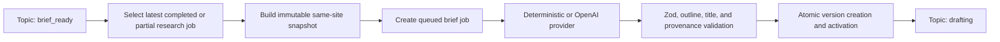

# Content brief generator

## Purpose

Phase 4 converts completed Phase 3 research into a structured planning document
for a later drafting phase. It does not write article prose, publish content, or
perform more research.



The repository has no `DRAFT_READY` status. Its established equivalent is
`DRAFTING`, so the centralized transition is `BRIEF_READY -> DRAFTING`.

## Eligibility and lifecycle

A first brief requires a `brief_ready` topic, a latest completed or partial
research job, at least one usable same-site note, and a grounded claim or useful
deterministic note. A nullable unique `active_topic_id` prevents two queued or
running jobs for one topic. Explicit regeneration is allowed for a `drafting`
topic that already has a brief.

Jobs move `queued -> running -> completed|failed`. Generation is atomic: an
invalid output is never stored as current, and a failed job leaves the topic
unchanged. Minor recorded gaps are allowed; a major gap fails validation.

## Research snapshot and input selection

Selection is deterministic:

1. choose the latest completed or partial research job for the topic and site;
2. order notes by creation time and ID;
3. reject mismatched site, topic, or research-job records;
4. normalize and deduplicate claim text while retaining all provenance;
5. reject evidence that belongs to another topic;
6. classify and prioritize sources conservatively as primary, official,
   reputable secondary, community, or unknown, with hostname diversity inside
   each quality tier;
7. prune provenance when the source cap is applied, so no dangling source
   references remain;
8. detect direct positive/negative claim conflicts deterministically;
9. apply note, claim, source, complete-prompt, and output limits.

Phase 3 stores claims in `ResearchNote.claims`, not in a claim table. Phase 4
therefore issues deterministic allowed references in the form
`<research-note-id>:claim:<position>`. Providers may select only those supplied
IDs. The stored snapshot contains research job ID, note IDs and versions,
evidence IDs, URLs, titles, excerpts, source fingerprints, claims, risks, and
open questions. Future note changes do not alter an existing brief.

The snapshot fingerprint is SHA-256 over canonical, key-sorted snapshot data.
The input fingerprint adds topic ID, mode, prompt version, safe adjustment, and
deterministic generation sequence. Timestamps are excluded.

## Structured brief

Operational and searchable fields are typed columns: site, topic, job, research
job, version, current status, title, intent type, article type, word-count
range, fingerprints, and timestamps. Bounded JSON fields retain the structured
audience, intent details, scope, outline, claims, sources, questions,
definitions, examples, statistics, caveats, gaps, link suggestions, drafting
instructions, and quality checklist.

Every outline section has a heading, purpose, key points, questions, optional
examples/warnings, claim references, and source references. The validator
rejects duplicate headings, article-like paragraphs, promotional titles,
invalid word-count ranges, unknown IDs, altered claim text, cross-snapshot
sources, and factual sections without provenance.

Titles are working suggestions. `best`, `ultimate`, `guaranteed`, and similar
unsupported language is rejected. Audience defaults to site
`targetAudience`; otherwise it is conservatively inferred and marked
`inferred: true`. Intent and article type use fixed taxonomies.

## Contradictions, uncertainty, and gaps

Direct positive/negative versions of the same normalized claim are recorded in
the immutable snapshot as contradictions. Providers must keep them as an
`unresolved_contradiction` gap and add a drafting warning instead of choosing a
truth. Phase 3 risks and open questions flow into caveats and research gaps.
Questions are marked `covered`, `partially_covered`, or `research_gap`. No
additional research is triggered. A major gap blocks persistence; minor gaps
remain visible to the drafter.

Internal links never invent URLs. Without a content index they are unresolved
topic concepts with `targetUrl: null`. External references must exactly match
snapshot notes/evidence.

## Providers and security

The brief domain uses the same provider-isolation pattern as research:

- `deterministic`: stable, free, provenance-preserving local output;
- `openai`: server-side Responses API structured output with Zod validation,
  one bounded schema/malformed-output repair attempt, and one small
  temporary-error retry. Fabricated IDs and provenance failures are not retried.

There is no silent production fallback. Enable fallback explicitly only if the
business accepts deterministic editorial quality.

Research is untrusted data. Fixed system instructions say that embedded
instructions must be ignored, secrets and internal state must not be revealed,
only supplied IDs may be used, unsupported claims are forbidden, and article
prose must not be generated. Input and output are length-limited and validated
again in the application. These controls reduce prompt-injection risk but do
not eliminate model risk.

## Idempotency, AI usage, and versioning

The database enforces one active job per topic, unique topic/version,
unique topic/input fingerprint, one current topic pointer, one brief per job,
unique AI request keys, and unique audit dedupe keys. A completed generation
endpoint call returns the stored brief. Provider reservations are not replayed
automatically after an ambiguous attempt.

Version allocation, old-version superseding, current-version creation, job
completion, AI-usage linking, audits, and topic transition run in a serializable
transaction with bounded conflict retries. Regeneration creates a new
fingerprint and version; old versions remain `superseded`.

Safe regeneration fields are target audience, article type, angle, outline
length, one emphasis, and excluded section names. They cannot override
provenance or safety constraints. The dashboard is intentionally read-only.

## Internal API

All routes require the existing `X-API-Key` or Bearer mechanism:

```text
POST /api/internal/topics/:topicId/brief-jobs
POST /api/internal/brief-jobs/:jobId/generate
GET  /api/internal/brief-jobs/:jobId
GET  /api/internal/topics/:topicId/briefs
```

Create accepts `mode`, `triggerType`, optional workflow reference, and safe
regeneration fields. The application owns selection, prompting, AI calls,
validation, versioning, persistence, and transitions. Responses are
`Cache-Control: no-store` and never return prompts, credentials, stack traces,
or provider/database errors.

## n8n workflow

Import `workflows/n8n/content-brief-generator.json`. Its readable SDK source is
`workflows/n8n/content-brief-generator.sdk.ts`.

1. Create Header Auth credential **AI Publishing OS Internal API**.
2. Set header name `X-API-Key` and value equal to `INTERNAL_API_KEY`.
3. Set `AI_PUBLISHING_OS_BASE_URL`, `CONTENT_BRIEF_TOPIC_ID`, and optional
   `CONTENT_BRIEF_MODE`.
4. Attach the credential to the application HTTP nodes.
5. Run **Manual Test Trigger**.

The daily schedule is disabled. n8n holds no database or OpenAI credentials and
contains no prompt or business validation. The application database mutex
prevents overlap.

## Environment

| Variable                                           | Default         |
| -------------------------------------------------- | --------------- |
| `CONTENT_BRIEF_DEFAULT_MODE`                       | `deterministic` |
| `CONTENT_BRIEF_AI_ENABLED`                         | `false`         |
| `AI_MODEL_CONTENT_BRIEF`                           | `gpt-5-mini`    |
| `AI_API_KEY`                                       | empty           |
| `CONTENT_BRIEF_ALLOW_DETERMINISTIC_FALLBACK`       | `false`         |
| `CONTENT_BRIEF_MAX_NOTES`                          | `20`            |
| `CONTENT_BRIEF_MAX_CLAIMS`                         | `50`            |
| `CONTENT_BRIEF_MAX_SOURCES`                        | `20`            |
| `CONTENT_BRIEF_MAX_PROMPT_CHARS`                   | `120000`        |
| `CONTENT_BRIEF_MAX_OUTLINE_SECTIONS`               | `12`            |
| `CONTENT_BRIEF_MAX_OUTPUT_TOKENS`                  | `4000`          |
| `CONTENT_BRIEF_MAX_GENERATIONS_PER_HOUR`           | `10`            |
| `CONTENT_BRIEF_MAX_GENERATIONS_PER_TOPIC_PER_HOUR` | `3`             |
| `CONTENT_BRIEF_MAX_CONCURRENT_AI_PER_SITE`         | `1`             |

All values are server validated. `AI_API_KEY` and internal authentication are
never browser-exposed.

## Verification

Apply migrations and run:

```text
pnpm db:migrate:deploy
pnpm db:validate
pnpm db:generate
pnpm env:validate
pnpm test:unit
pnpm test:integration
pnpm test:e2e -- tests/e2e/content-brief.spec.ts
pnpm test:smoke:brief
```

The smoke test requires PostgreSQL and a running dashboard. It verifies
authentication rejection, insufficient research, deterministic generation,
snapshot provenance, version 1, replay safety, explicit version 2,
version-history retrieval, and the `drafting` transition.

On the dashboard, inspect **Current content brief** for title, mode, version,
audience, intent, angle, word count, outline, source links, gaps, drafting
instructions, checklist, and prior versions. Strings are React-escaped; source
HTML is never rendered.

## Troubleshooting and limitations

- `401 unauthorized`: configure Header Auth.
- `409 ineligible_topic`: first generation needs `brief_ready`; regeneration
  needs a current brief and `forceRegeneration: true`.
- `409 active_brief_job_exists`: finish or investigate the active job.
- `422 insufficient_research`: complete Phase 3 with at least one usable note.
- `422 fabricated_*`: provider IDs or sources did not match the snapshot.
- `502 ai_invalid_output`: structured output failed schema or provenance checks.

Known limitations: claims remain snapshot references rather than normalized
claim rows because Phase 3 stores claim JSON; source quality is conservative,
not a ranking engine; contradiction recognition depends on stored risks and
provider output; the dashboard has no editor or regeneration controls; pricing
is not hardcoded. This phase adds no article drafting, publishing, WordPress,
keyword tools, Search Console, Reddit, GitHub collection, images, or autonomous
agents.
