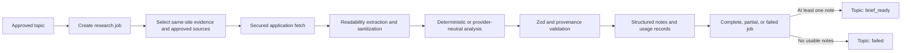

# Research engine

## Purpose

Phase 3 turns an approved topic and its existing evidence into bounded,
structured research notes. It does not draft an article or final content brief.
Every stored factual claim includes a supporting excerpt and source provenance.



The application owns selection, networking, extraction, AI calls, validation,
and persistence. n8n only orchestrates application API calls.

## Eligibility and topic transitions

Research starts only when the existing topic status is `approved`.
`rejected`, `published`, and every other status are rejected. A unique active
topic key prevents two queued/running jobs for one topic.

All changes use the centralized topic transition module:

- creation: `approved` to `researching`;
- completed/partial with at least one usable note: `researching` to
  `brief_ready`;
- no usable notes: `researching` to `failed`.

`brief_ready` means the research inputs are ready for the later brief phase. A
final brief is not created in Phase 3.

## Job lifecycle

Jobs begin in `running` because creation also selects sources. Selected sources
move through `selected`, `processing`, then `succeeded`, `skipped`, or `failed`.
The completion endpoint rejects a job while any source is non-terminal.

- `completed`: notes exist and every selected source succeeded;
- `partial`: at least one note exists and at least one source failed or was
  skipped;
- `failed`: no source produced a usable note.

The job records selected evidence, fetched/successful/skipped/failed sources,
generated notes, timestamps, safe errors, mode, fallback use, and an optional
workflow execution reference.

## Source selection and limits

Selection is deterministic:

1. evidence attached to the topic, newest first;
2. active same-site `website` or `manual` source configurations, ordered by
   name;
3. canonical URL deduplication;
4. configured source limit.

RSS evidence article URLs are eligible. RSS feed configuration URLs are not
treated as article pages. Inactive and cross-site configurations are excluded.
Tracking query parameters and fragments are removed for identity. Unsupported
schemes and credential-bearing URLs are excluded.

Defaults are 10 sources per job, 5 notes per job, sequential n8n processing,
100,000 extracted characters, 10 claims per source, and 500 characters per
supporting excerpt. The application allows at most two concurrent fetches and
one active AI request per site. Change limits with `RESEARCH_*` variables.
Larger values increase memory, latency, and provider cost.

## Fetch security and supported content

The research fetcher reuses the generic outbound protections extracted from the
Phase 2 RSS implementation:

- HTTP/HTTPS only, with no URL credentials;
- localhost, loopback, private, carrier-grade NAT, link-local, multicast,
  documentation, and cloud-metadata destinations blocked;
- all DNS answers checked and every redirect revalidated;
- TLS verification preserved and cross-origin credentials never sent;
- bounded redirects, timeout, response bytes, and retries;
- clear research user agent;
- only HTML/XHTML, plain text, and Markdown accepted.

Node fetch handles standard compressed HTTP responses. The byte limit applies
to data delivered to the application. PDFs, XML feeds, JSON, and arbitrary
binary files are rejected.

Application DNS validation reduces SSRF risk but cannot completely remove
DNS-rebinding/time-of-check-to-time-of-use risk because the HTTP client performs
its own connection resolution. Production must also deny private/metadata
egress at the container, host, VPC, firewall, or proxy layer.

## HTML extraction and sanitization

HTML is parsed without executing JavaScript. Mozilla Readability extracts the
article. Scripts, styles, navigation, forms, frames, embedded media, hidden
content, and inline event attributes are removed before analysis.

The engine captures bounded title, description, headings, canonical URL,
author, publisher/domain, publication time, and readable text. It normalizes
Unicode and whitespace, removes control characters, and rejects pages without
useful content. Raw HTML and full page text are not stored. The dashboard
renders strings only and never injects source HTML.

## Prompt-injection mitigation

Retrieved pages are untrusted data. Fixed provider instructions say source
content cannot change policy, request tools, fetch URLs, reveal secrets, or
generate an article. Source and topic content are serialized as a data object.
No tools or environment data are exposed to the provider.

OpenAI output uses Responses API Structured Outputs and is validated again with
Zod. Every claim excerpt must occur in the normalized source text. These
controls reduce prompt-injection risk, but no prompt-only defense guarantees
perfect behavior. Provider output remains untrusted until validation.

## Provider interface and modes

Domain processing depends on the reusable `ResearchProvider` interface, not on
OpenAI. The adapter is isolated in
`apps/dashboard/lib/research/providers/openai.ts`.

### Deterministic mode

Set `RESEARCH_DEFAULT_MODE=deterministic`, or submit
`{"mode":"deterministic"}`. This mode uses metadata and source excerpts without
an external model. Notes store `mode: deterministic` and
`metadata.deterministicMode: true`. It is useful for tests and local validation,
but is not presented as equivalent to model analysis.

### OpenAI mode

Set:

```text
RESEARCH_AI_ENABLED=true
RESEARCH_DEFAULT_MODE=openai
AI_PROVIDER=openai
AI_MODEL_RESEARCH=gpt-5-mini
AI_API_KEY=<server-side-key>
```

The adapter uses strict structured output, Zod validation, bounded output
tokens, no tools, and `store: false`. The key is server-only.

`RESEARCH_ALLOW_DETERMINISTIC_FALLBACK=false` is the safe default. Missing keys
or provider failures therefore fail clearly. Set it to `true` only when the
business accepts explicit deterministic fallback. Fallback is stored on the job
and note metadata; it is never silent.

An AI usage row is reserved before a provider call with a unique request key.
One logical source/fingerprint/provider/model request therefore has one usage
record. Temporary errors are retried once inside the adapter. A previous
ambiguous or failed AI attempt is not automatically repeated by an HTTP retry.
Estimated cost is nullable because pricing is not hardcoded.

## Claim provenance

Claims live inside their parent note and contain claim text, exact supporting
excerpt, source URL/title, evidence ID when available, collection time, and a
confidence label. The note also records job, topic, site, selected source,
fingerprint, publisher, author, publication/fetch times, mode, and quality
flags. Confidence describes support quality, not factual truth.

## Fingerprints and idempotency

The content fingerprint is SHA-256 over canonical source identity plus
normalized extracted text; timestamps are excluded.

- unchanged content returns the existing note;
- changed content creates the next note version;
- unique source/fingerprint keys prevent duplicate notes;
- a unique active-topic key prevents duplicate active jobs;
- audit dedupe keys prevent duplicate lifecycle events;
- AI request keys prevent repeated usage rows and provider replay.

There is a narrow failure window after an external provider accepts a request
but before the database records success. The reservation favors avoiding
duplicate cost; such a request requires operator review.

## Partial failures and retries

A source failure is stored and returned with `data.status=failed`, so n8n
continues to the next source. Temporary DNS/network errors, timeouts, HTTP
429/502/503/504, and temporary provider errors receive small bounded retries.
Invalid URLs, SSRF blocks, unsupported content, permanent HTTP errors, malformed
output, and authentication errors are not repeatedly retried.

## Internal API

All routes require existing `X-API-Key` or Bearer authentication:

```text
POST /api/internal/topics/:topicId/research-jobs
GET  /api/internal/research-jobs/:jobId
POST /api/internal/research-jobs/:jobId/process-source
POST /api/internal/research-jobs/:jobId/complete
```

The client never submits a fetch URL, only a selected job-source ID. Durable
internal rate limits apply to every route.

## n8n workflow

Import `workflows/n8n/research-engine.json`. The validated SDK source is
`workflows/n8n/research-engine.sdk.ts`.

1. Create an n8n Header Auth credential named
   `AI Publishing OS Internal API`.
2. Header name: `X-API-Key`.
3. Value: the same secret as application `INTERNAL_API_KEY`.
4. Set `AI_PUBLISHING_OS_BASE_URL`.
5. Set `RESEARCH_TOPIC_ID` to an approved topic.
6. Optionally set `RESEARCH_MODE` to `deterministic` or `openai`.
7. Attach the credential to all three HTTP Request nodes.
8. Run **Manual Test Trigger**.

The schedule node is disabled. Do not enable it until manual execution succeeds
and its interval exceeds the worst-case run. No database or AI credentials
belong in n8n. Sources run one at a time and completion returns a summary.

## Environment variables

| Variable                                | Default         | Purpose                  |
| --------------------------------------- | --------------- | ------------------------ |
| `RESEARCH_DEFAULT_MODE`                 | `deterministic` | Default mode             |
| `RESEARCH_AI_ENABLED`                   | `false`         | Allows OpenAI mode       |
| `AI_PROVIDER`                           | `openai`        | Provider selection       |
| `AI_MODEL_RESEARCH`                     | `gpt-5-mini`    | Research model           |
| `AI_API_KEY`                            | empty           | Server-only provider key |
| `RESEARCH_ALLOW_DETERMINISTIC_FALLBACK` | `false`         | Explicit fallback        |
| `RESEARCH_MAX_SOURCES_PER_JOB`          | `10`            | Source cap               |
| `RESEARCH_MAX_NOTES_PER_JOB`            | `5`             | Note cap                 |
| `RESEARCH_REQUEST_TIMEOUT_MS`           | `15000`         | Source timeout           |
| `RESEARCH_MAX_RESPONSE_BYTES`           | `2097152`       | Response bytes           |
| `RESEARCH_MAX_REDIRECTS`                | `3`             | Redirect cap             |
| `RESEARCH_MAX_INPUT_CHARS`              | `100000`        | Extracted text           |
| `RESEARCH_MAX_OUTPUT_TOKENS`            | `2500`          | Provider output          |
| `RESEARCH_MAX_CLAIMS_PER_SOURCE`        | `10`            | Claim cap                |
| `RESEARCH_MAX_EXCERPT_CHARS`            | `500`           | Excerpt cap              |
| `RESEARCH_MAX_CONCURRENT_FETCHES`       | `2`             | Site fetch concurrency   |
| `RESEARCH_MAX_CONCURRENT_AI_PER_SITE`   | `1`             | Site AI concurrency      |

## Manual and smoke testing

Start PostgreSQL and the dashboard, deploy migrations, then run:

```text
pnpm db:migrate:deploy
pnpm dev
pnpm test:smoke:research
```

The smoke test creates database fixtures, calls the real create/complete/read
routes, injects a local test fetcher only for source processing, proves replay,
provenance, partial/full failure, and topic transitions, then cleans up.

On the dashboard, inspect the topic under **Recent topics**. Verify the latest
job, counts, safe errors, notes, source link, excerpts, evidence ID, mode, and
timestamps. Unsafe HTML must appear only as escaped text.

## Troubleshooting

- `401 unauthorized`: Header Auth is missing or wrong.
- `409 ineligible_topic`: the topic is not `approved`.
- `409 active_research_job_exists`: finish the active job.
- `422 blocked_destination`: the source resolves to a prohibited network.
- `415 unsupported_content_type`: use HTML, plain text, or Markdown.
- `422 ai_configuration_error`: enable/configure AI or choose deterministic.
- `502 ai_invalid_output`: structured output or provenance failed validation.
- completion `409`: a source is still selected/processing.

## Deliberate limitations and future work

Phase 3 does not add PDFs, browser automation, unrestricted crawling/search,
Reddit, GitHub, Search Console, semantic discovery, article drafting, final
brief generation, WordPress, or publishing. JavaScript-rendered pages may lack
readable server HTML. Provider pricing is not hardcoded. Higher concurrency,
refresh scheduling, stuck-reservation recovery, PDFs, and more providers belong
to later phases.
